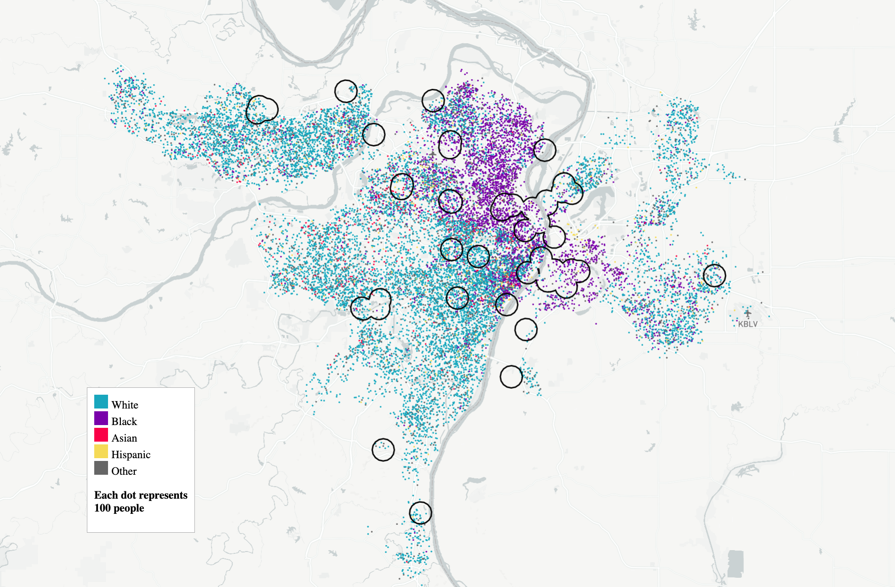

**This project is no longer maintained by Two Sigma. We continue to encourage independent development.**

  

# Hazards at Home: An Analysis of EPA Risk Management Program facility locations

  

This repository is the result of a [Hack Day](https://www.twosigma.com/articles/hacking-with-data-clinic/) Data Clinic hosted in the spring of 2023. The topic of the Hack Day was the EPA's database of Risk Management Program facilities, recently made easy to access by the [Data Liberation Project](https://www.data-liberation-project.org/). We chose to focus on understanding how the demographics of areas close to one of the facilities differ from the demographics of cities overall and displaying these patterns using dot-density maps. 

### Getting started

This repository generates the statistics and visualizations included in this [article](https://www.twosigma.com/articles/hazards-at-home).

#### Installations
Make sure you have Python 3.9 or above. You can check in the command line with python --version or python3 --version

To create a virtual environment within this head directory `cd EPA-HACK-DAY-ANALYSIS`, run `python3 -m venv venv`. The second "venv" can be any name of your virtual environment.

Run the following to activate virtual environment to use and disable to stop using:

bash (Mac OS, Linux): source venv/bin/activate
win (windows): venv\Scripts\activate.bat or venv\Scripts\activate.ps1 for powershell

`deactivate` will deactivate your virtual env

Once your environment is activated, run `python3 -m pip install -r requirements.txt`.

### Open Data Files

1.  First, visit the [Data Liberation Project EPA-RMP github page](https://github.com/data-liberation-project/epa-rmp-spreadsheets/tree/main/data/output) and download `submissions.csv`, `facilities.csv`, and `naics-codes.csv` and place them in `data/raw` in this project directory.
2.  Next, execute the pipeline by running `make all` in your terminal from the project directory.

### Processed Files
Running this pipeline will generate several data assets. 

-  `data/processed/facilities_geo.geojson` contains a cleaned and processed version of the RMP facilities dataset
- `data/processed/US_bg_census.geojson` contains block group level American Community Survey data for the entire US
-  `data/processed/urban_area_statistics.csv` contains the fenceline-to-city ratios for each city across our set of census metrics.
-  The folder `data/viz/` will contain subdirectories for each of the cities in our analysis. Inside these directories are the data files needed to produce the dot-density maps we include in the blog post.

### Directory Structure

    building-emissions/
    ├── LICENSE
    ├── Makefile                      
    ├── requirements.txt
    ├── README.md                     <- The top-level README for developers using this project
    │
    ├── data                          
      ├── raw                         <- You must add these yourself
        ├── submissions.csv               <- RMP submissions records
        ├── facilities.csv                <- RMP facility information
        ├── naics-codes.csv               <- Industry code mapping
      ├── processed
        ├── urban_area_statistics.csv     <- Fenceline-to-city ratios for each city
        ├── facilities_geo.geojson        <- Cleaned and processed version of the RMP facilities dataset
        ├── US_bg_census.geojson          <- Block group level American Community Survey data
      ├── viz
        ├── [city]                        <- Subdirectories for each city containing data needed for dot density map
    ├── src
      ├── data
        ├── preprocess_RMP.py            <- Basic preprocessing 
        ├── clean_RMP.py                 <- Cleaning and filling missing locations
        ├── download_census.py           <- Downloads American Community Survey data with censusdis
     ├── analysis
        ├── interpolate_census.py        <- Calculates fenceline-to-city ratios for each city
        ├── national_map.py              <- Creates data for interactive national map
        ├── city_dot_density.py          <- Creates data for dot-density maps
     ├── viz
        ├── dot_density.html             <- D3 visualization for dot-desnity maps
        ├── viz_data                     <- Folder with files for national facility map
        ├── facility_location
          ├── index.html                 <- D3 national map visualization
    ├── notebooks
        ├── ridgeplot.ipynb       <- Creates ridgeplot for blog

### Instructions for generating dot-density maps for any city

Once the pipeline has run and `data/viz/` has been populated, you can view dot density maps for any city by following these steps:

1.  Navigate to `viz/dot_denisty.html` and replace the city defined in line 40 with the name of the `data/viz/` folder for the city you want to look at (e.g. `batonrouge` for Baton Rouge).
2.  Run `python -m http.server 8000` from the project home directory
3.  Open `http://localhost:8000/viz/dot_density.html` in your web browser.

You should see an interactive dot-density map marking the fenceline zone in your chosen city.

### Data Clinic
[Data Clinic](https://www.twosigma.com/data-clinic/) is the data and tech-for-good arm of [Two Sigma](https://twosigma.com), a financial sciences company headquartered in NYC. Since Data Clinic was founded in 2014, we have provided pro bono data science and engineering support to mission-driven organizations around the world via close partnerships that pair Two Sigma's talent and way of thinking with our partner's rich content-area expertise. To scale the solutions and insights Data Clinic has gathered over the years, and to contribute to the democratization of data, we also engage in the development of open source tooling and data products.
